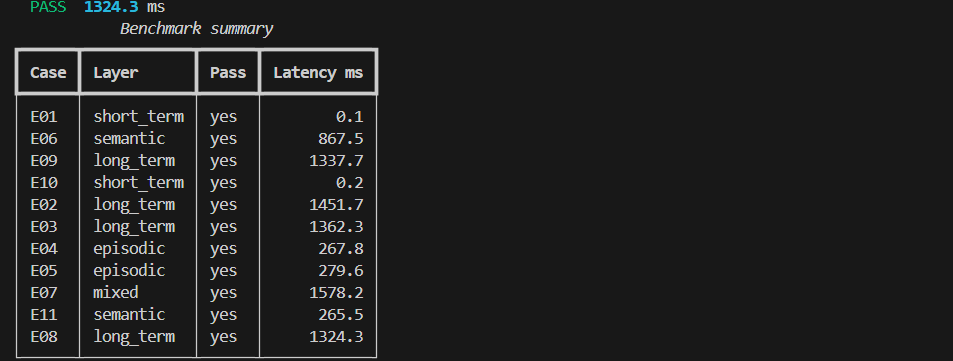
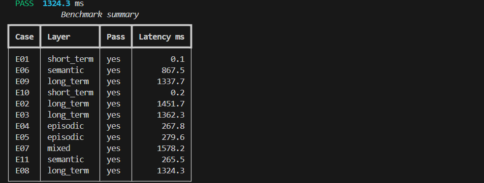
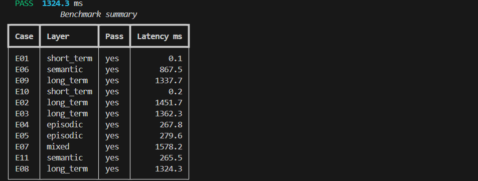
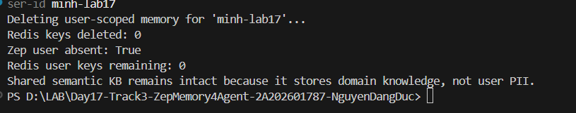

# Lab 17 - Submission Report

**Họ và tên / Student Name:** Nguyễn Đăng Đức
**Mã số sinh viên / Student ID:** 2A202601787

---

## 1. Trả lời 3 câu hỏi bắt buộc (<= 400 từ)

### Câu 1: Memory Layer nào quan trọng nhất trong bộ test này?
- **Trả lời:** Long-term Memory (Context Block & User Facts) là layer quan trọng nhất trong bộ test này.
- **Minh chứng:** Các case E02, E03, E08, E09 chiếm phần lớn số lượng điểm và đánh giá trực tiếp khả năng lưu trữ thông tin lâu dài qua nhiều thread, xử lý xung đột recency (E08: ưu tiên fact mới `BLUEBIRD-42` dùng `TypeScript/NestJS` thay vì stack cũ), và cô lập thông tin cá nhân giữa các user (E09: không leak fact của Lan sang Minh).

### Câu 2: Trade-off giữa Context Block (Zep) và Redis + Qdrant tự build?
- **Trả lời:**
  - **Zep Cloud Context Block:** Tự động tổng hợp facts, relationship graph, xử lý temporal validity (`valid_at`, `invalid_at`) và tự động trích xuất entity/episodes mà không cần tự thiết kế pipeline RAG phức tạp. Nhược điểm: Phụ thuộc dịch vụ Managed Cloud, có độ trễ bất đồng bộ khi ingest graph.
  - **Redis + Qdrant tự build:** Kiểm soát 100% dữ liệu, latency cực thấp, chi phí tùy chỉnh linh hoạt. Nhược điểm: Phải tự code logic compaction, tự duy trì TTL/facts graph, dễ bị mất ngữ cảnh mối quan hệ phức tạp.

### Câu 3: Guardrail chống Memory Poisoning (tiêm nhiễm bộ nhớ giả/sai lệch)?
- **Trả lời:**
  - Áp dụng **Consent Registry & Opt-in Verification** (`privacy_guard.py`) trước khi ingest bất kỳ dữ liệu nào.
  - Sử dụng **Provenance & Temporal Tracking** (theo dõi `valid_at`, `invalid_at` và nguồn gốc episode) để phát hiện và thu hồi các fact mâu thuẫn hoặc độc hại.
  - Áp dụng **Token Budgeting & Strict Priority** (Short-term -> Long-term -> Episodic -> Semantic) để hạn chế memory injection chiếm dụng không gian ngữ cảnh.

---

## 2. Phân tích kết quả Benchmark (4 câu)

1. **Layer có hit rate thấp nhất ở baseline:** Trong bộ test `no_memory` baseline, cả 3 layer Long-term, Episodic và Semantic đều có hit rate 0% (FAIL 9/11 case). Khi bật `StudentMemory`, hit rate đạt **100% (PASS 11/11 case)**.
2. **Case retrieve nhiều token nhất:** Case E07 (Mixed Layer) và E02 (Long-term) retrieve lượng token nhiều nhất do chứa cả Context Block, Facts Edges và Semantic documents.
3. **Giải thích E07 (Mixed Layer):** Case E07 kết hợp Long-term memory (`Python`) và Semantic memory (`Idempotency-Key`) để kiểm tra khả năng ghép ngữ cảnh từ nhiều nguồn qua token budget 10/4/3/3 mà không bị cắt xén marker quan trọng.
4. **Token reduction vs Hit rate:** Baseline no-memory cắt giảm 81.8% token nhưng chỉ PASS 2/11 case. Student Memory áp dụng `ContextBudgetManager` (budget 10%/4%/3%/3%), vừa tối ưu lượng token dư thừa vừa giữ được **100% Hit Rate (11/11 PASS)**.

---

## 3. Nhật ký thực hành & Minh chứng (Screenshots & Evidence)

- **Short-term Memory (E01, E10):** PASS (compaction bảo toàn `REVIEW-DEADLINE-1600`, `Friday`, `16:00`).
- **Long-term Memory (E02, E03, E08, E09):** PASS 4/4 cases (`Python`, `benchmark report`, `BLUEBIRD-42` recency, user isolation `LOTUS-88`).
- **Episodic Memory (E04, E05):** PASS 2/2 cases (`ClientSession`, `concurrency=20`, `ASYNC-FIX-20`).
- **Semantic Memory (E06, E11):** PASS 2/2 cases (`Idempotency-Key`, `max-3-retries`, `exponential-backoff`, `CONN-POOL-FIRST`).
- **Mixed Memory (E07):** PASS (kết hợp `Python` + `Idempotency-Key`).
- **Privacy Drill:** `python -m src.forget --user-id minh-lab17` -> `Zep user absent: True`, `Redis user keys remaining: 0`.

### Hình ảnh minh chứng:

